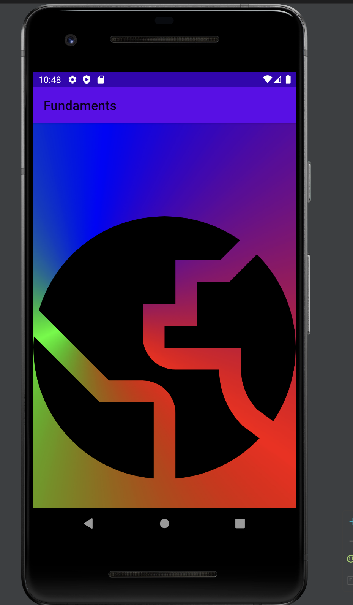
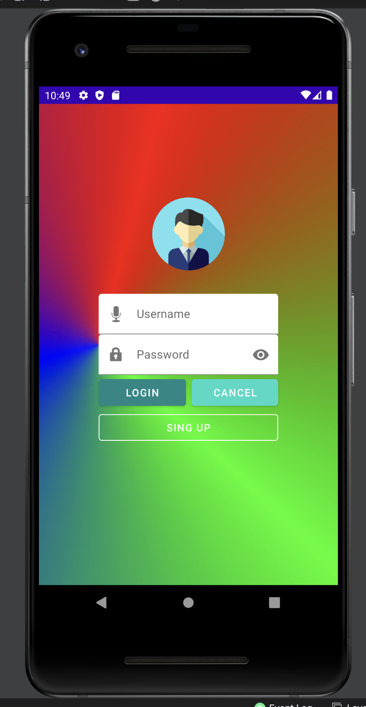
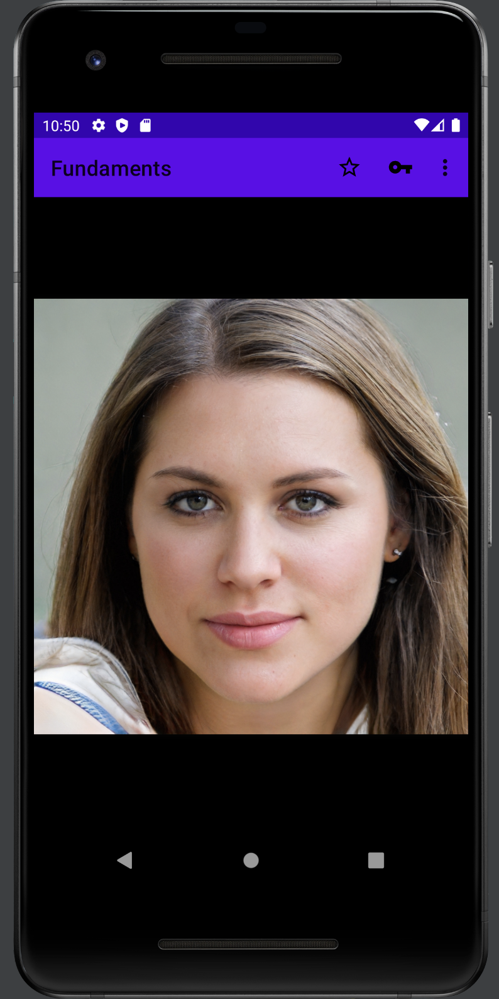
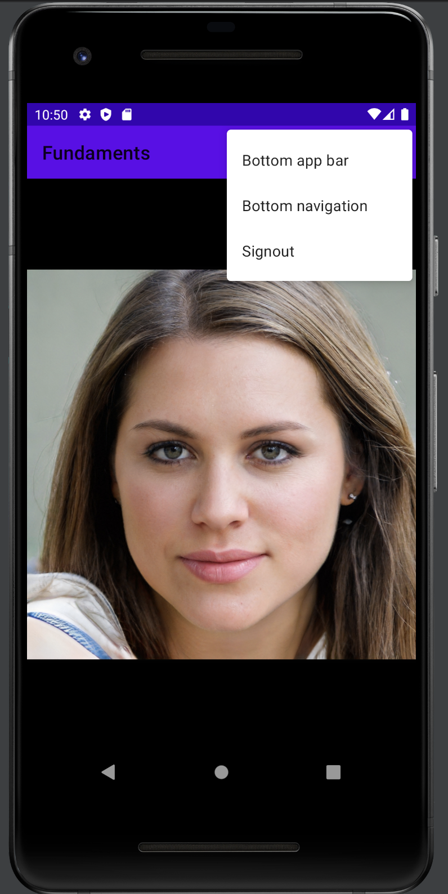

# FIRST

## Project made to learn how to use the [Android Studio](https://developer.android.com/) framework.

### What have we learned?

- [x] How to use the Android Studio framework
- [x] How to implement Google widgets
- [x] How to utilize git and GitHub for version control

### Project structure:

- Activities and Screens
  - [Splash](app/src/main/java/com/study/fundaments/Splash.kt)
  - [Login](app/src/main/java/com/study/fundaments/Login.kt)
  - [Register](app/src/main/java/com/study/fundaments/Signup.kt)
  - [Main](app/src/main/java/com/study/fundaments/Main.kt)

- Menus (Implemented in Main View)
    - [Menu Appbar](app/src/main/res/menu/menu_appbar.xml)
    - [Menu Options](app/src/main/res/menu/menu_appbar.xml)

- [Animations](app/src/main/res/anim/rotate.xml) (Implemented in Splash View, Register View and Login View)
- [Colors](app/src/main/res/values/colors.xml)
- [Strings](app/src/main/res/values/strings.xml)
- [App Icon](app/src/main/res/drawable/ic_world.xml)
- [Manifest](app/src/main/AndroidManifest.xml)
- #### And a lot of more thing that we can't remember right now

### Screenshots

- Here we can see the splash screen, with a simple animation and a logo.

- Here we can see the login screen, with a simple animation, the profile picture, and the login credentials input.

- Here we can see the register screen, with a simple animation, the profile picture, and the register credentials input, both this views can navigate to each other or commit to the main view.

- Here we can see the main screen, for now it only contain a picture and some action that will later be implemented.

- And finally once the button bar is clicked it will show all action that can be done.

### Technologies used
- [Android Studio](https://developer.android.com/)
- [Kotlin](https://kotlinlang.org/)
- [Git](https://git-scm.com/)
- [GitHub](https://github.com/JoaquinAyG)
- Libraries
  - [Material Design](https://material.io/develop/android/docs/getting-started/)
  - [Glide](https://github.com/bumptech/glide)

### Author
**Joaquin Ayllón García**

Thanks for reading and hope yoy enjoy it.